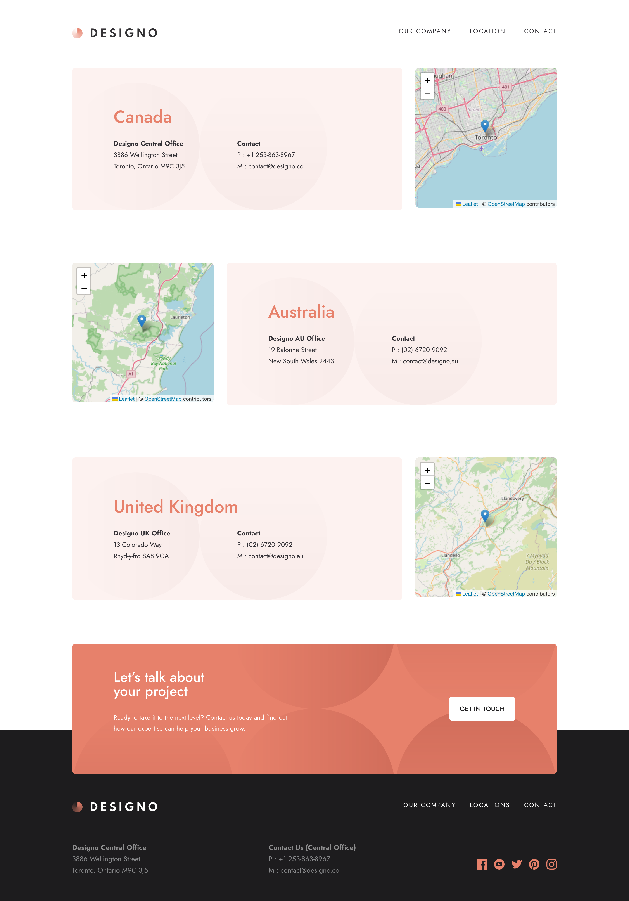

# Designo agency website

## Table of contents

- [Overview](#overview)
  - [The challenge](#the-challenge)
  - [Screenshot](#screenshot)
  - [Links](#links)
  - [Built with](#built-with)
- [Author](#author)

## Overview

Users are able to:

- View the optimal layout for each page depending on their device's screen size
- See hover states for all interactive elements throughout the site
- Receive an error message through server side validation when the contact form is submitted if:
  - The `Name`, `Email Address` or `Your Message` fields are empty
  - The `Email Address` is not formatted correctly
- : View actual locations on the locations page maps ( [Leaflet JS](https://leafletjs.com/) was used for this)

### Screenshot

### Links

- Solution URL: [https://github.com/12Ricky0/designo.git](https://github.com/12Ricky0/designo.git)
- Live Site URL: [Add live site URL here](https://your-live-site-url.com)

### Built with

- Tailwind CSS
- TypeScript
- Zod
- Mobile-first workflow
- [React](https://reactjs.org/) - JS library
- [Next.js](https://nextjs.org/) - React framework
- [Leaflet JS](https://leafletjs.com/) - For maps

## Author

- Frontend Mentor - [@12Ricky0](https://www.frontendmentor.io/profile/12Ricky0)
- Instagram - [@temple4b](https://www.instagram.com/temple4b)
